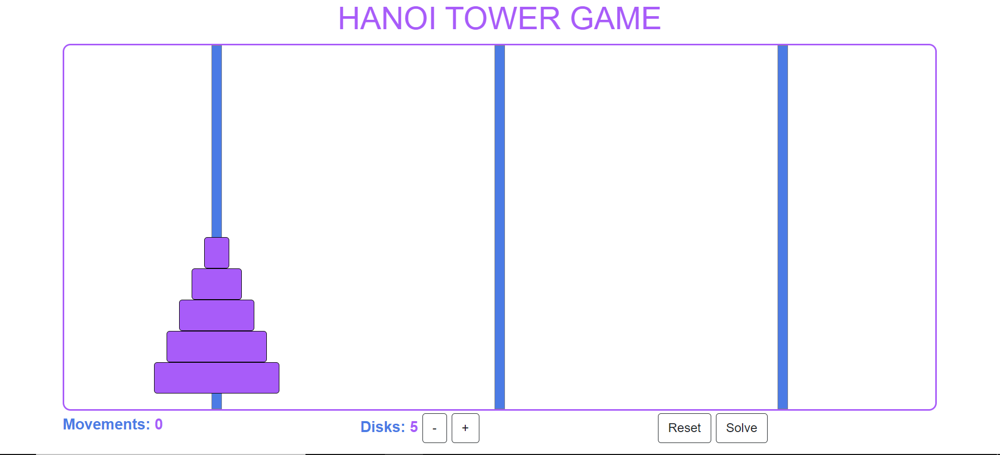

# HANOI TOWER GAME

App that allows to play the Hanoi tower game using linked lists and recursive functions.

1.  Main view of the game with its controls.

# Deployment

VERCEL:

[LINK](https://hanoi-tower-game.vercel.app/)

## Screenshots

## Libraries

1.  [React](https://es.reactjs.org/)
2.  [React Bootstrap](https://react-bootstrap.github.io/)

## Install and run project

1. Clone repo.
2. Install modules `npm install` .
3. Run project `npm start`
